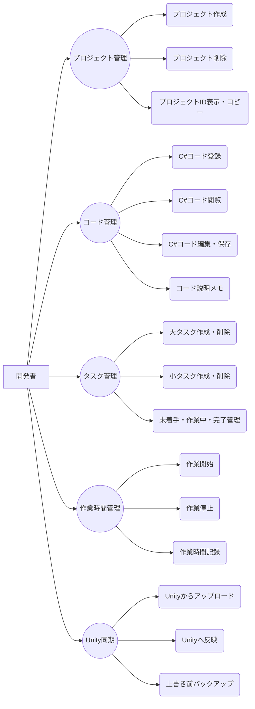
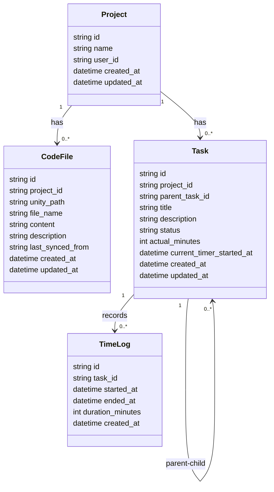
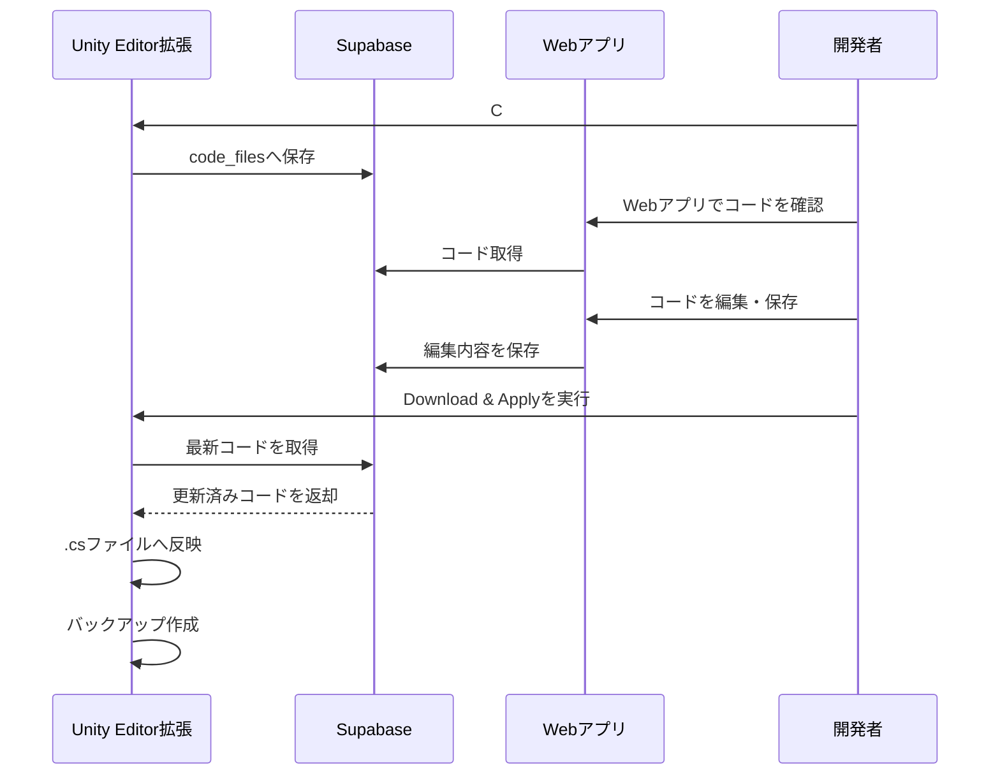
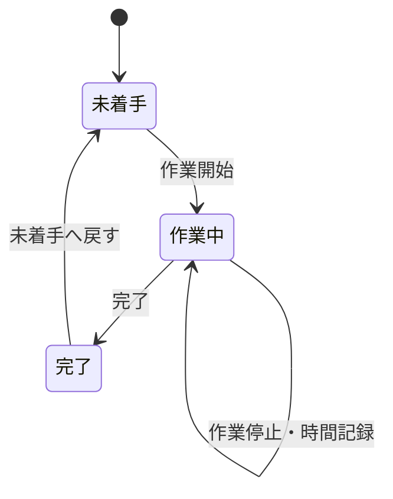

# Unity Architect Note

Unity Architect Noteは、Unityゲーム開発で使用するC#スクリプトをクラウド経由でWebアプリと同期し、PCやスマートフォンからコード確認・編集、タスク管理、作業時間管理を行える開発支援ツールです。

## 概要

本システムでは、Unity Editor拡張からUnityプロジェクト内のC#スクリプトをSupabaseへアップロードし、Next.jsで作成したWebアプリ上でコードを確認・編集できます。

Webアプリで編集したコードは、Unity Editor拡張のDownload & Apply機能によってUnityプロジェクト内の`.cs`ファイルへ反映できます。

また、プロジェクトごとに大タスク・小タスクを作成し、未着手・作業中・完了の状態管理や、作業時間の計測を行うことができます。

---

## 主な機能

### ユーザー管理

- ユーザー登録
- ログイン
- ログアウト

### プロジェクト管理

- プロジェクト作成
- プロジェクト削除
- プロジェクトID表示
- プロジェクトIDコピー

### コード管理

- C#コードファイル登録
- C#コード表示
- C#コード編集・保存
- コード説明メモの記録
- Unity EditorからC#コードをSupabaseへアップロード
- Webで編集したC#コードをUnityへ反映
- 上書き前のバックアップ作成

### タスク管理

- 大タスク作成
- 小タスク作成
- 大タスク削除
- 小タスク削除
- 未着手 / 作業中 / 完了のステータス管理
- 完了タスクの並び順管理

### 作業時間管理

- タスクの作業開始
- タスクの作業停止
- 作業時間の自動計測
- 累計作業時間の表示
- 作業ログの保存

### Unity Editor拡張

- Supabaseログイン
- C#コードアップロード
- C#コードダウンロード反映
- Download & Apply機能
- 上書き前バックアップ
- EditorPrefsによる設定保存

---

## 使用技術

### フロントエンド

- Next.js
- React
- TypeScript
- Tailwind CSS

### バックエンド / データベース

- Supabase
- PostgreSQL
- Supabase Authentication
- Row Level Security

### Unity連携

- Unity
- C#
- Unity Editor拡張
- UnityWebRequest
- EditorPrefs

### 開発・公開環境

- Visual Studio Code
- GitHub
- Vercel
- Unity Hub

---

## データベース

使用した主なテーブルは以下です。

### projects

プロジェクト情報を管理するテーブルです。

### code_files

UnityのC#コードファイルを管理するテーブルです。

### tasks

大タスク・小タスク、ステータス、累計作業時間を管理するテーブルです。

### time_logs

作業開始・停止による作業時間の履歴を保存するテーブルです。

---

## システム構成

```text
Unity Editor拡張
        ↓
     Supabase
        ↑
   Next.js Webアプリ
        ↑
PC・スマートフォン
```

---

## Unity連携の流れ

```text
Unity Editor
↓
C#スクリプトをSupabaseへアップロード
↓
Webアプリでコードを確認・編集
↓
Supabaseに保存
↓
Unity EditorでDownload & Apply
↓
Unityプロジェクト内の.csファイルへ反映
```

---

## タスク管理の流れ

```text
プロジェクト作成
↓
大タスク作成
↓
小タスク作成
↓
作業開始
↓
タイマー計測
↓
作業停止
↓
作業時間記録
↓
完了
```

---

## ユースケース図



---

## クラス図



---

## 協調図



---

## 状態遷移図



---

## セットアップ

### Webアプリ

依存関係をインストールします。

```bash
npm install
```

開発サーバーを起動します。

```bash
npm run dev
```

ローカルで以下のURLにアクセスします。

```text
http://localhost:3000
```

---

## 環境変数

`.env.local` に以下を設定します。

```env
NEXT_PUBLIC_SUPABASE_URL=your_supabase_url
NEXT_PUBLIC_SUPABASE_ANON_KEY=your_supabase_publishable_key
```

---

## Unity Editor拡張の使い方

Unityプロジェクト内に以下のように配置します。

```text
Assets/Editor/UnityArchitectNoteWindow.cs
```

Unity上部メニューから以下を開きます。

```text
Tools > Unity Architect Note
```

Unity Editor拡張では、以下を入力します。

- Supabase URL
- Supabase Publishable Key
- Email
- Password
- Project ID
- Scripts Folder

その後、以下の操作を行います。

```text
Login to Supabase
↓
Upload C# Scripts to Supabase
↓
Webアプリでコード編集
↓
Download & Apply Scripts from Supabase
```

---

## 工夫した点

- Unity Editor拡張とWebアプリを連携し、C#コード同期を実現した
- PCだけでなくスマートフォンからもコード確認・タスク管理ができるようにした
- 大タスク・小タスクによる階層タスク管理を実装した
- 作業開始・停止によって作業時間を記録できるようにした
- Unity側へ反映する前にバックアップを作成するようにした
- プロジェクトIDコピー機能を追加し、Unity Editor拡張との接続をしやすくした
- Vercelにデプロイし、スマートフォンからも利用できるようにした

---

## 今後の課題

- コード差分表示機能
- コードファイル削除機能
- タスク検索機能
- 作業時間のグラフ表示
- 複数人での共同編集
- 競合検知機能
- Unity側で同期対象ファイルを選択する機能
- UI/UXの改善

---

## 公開URL

```text
https://unity-architect-note.vercel.app
```

---

## GitHub

```text
https://github.com/sfvyckn4ym-ai/unity-architect-note
```